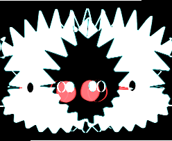

# gartus

I finished this some time ago. But i just added a bunch of features.

- Work with images made outside this engine and manuipulate them
- Filters
- HSL support
- turtle support	
- And of course: curves :)

