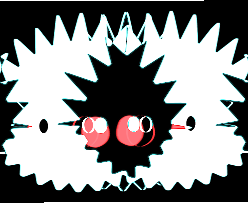

# gartus

`gartus` is a graphics playground/library with raster drawing, mesh utilities,
renderer-neutral surface scene data, and a small path tracer based on the
*Ray Tracing* book series.

- Work with images made outside this engine and manuipulate them
- Filters
- HSL support
- turtle support	
- And of course: curves :)

## Ray tracing examples

The ray-tracing examples write PNG files into `final/raytracing/`.

Use the render profile for full path-traced examples:

```bash
cargo run --profile render --example life
```

For iteration, lower the image width and sample count first. For example:

```rust
const IMAGE_WIDTH: u32 = 300;
const MAX_DEPTH: u32 = 12;
```

For fixed final renders, prefer explicit stratified grids:

```rust
RayCamera::new(600, 1.0)
    .with_stratified_grid_width(32)
    .with_max_depth(20);
```

For faster random previews, adaptive sampling can stop converged pixels before
the maximum sample count:

```rust
RayCamera::new(400, 1.0)
    .with_adaptive_sampling(16, 256, 0.01)
    .with_max_depth(20);
```

Indoor scenes should pass a dedicated `SamplingTargetList` to
`PathTracer::render_with_lights` rather than using the whole world as the light
target. Large built-in geometry scenes should use `RayScene` so the cached BVH
can accelerate ray traversal; `HittableList` remains useful for book-style
examples and custom hittables.

For renderer-neutral mesh scenes, build a `SurfaceScene` once and render it
through either `SurfaceScene::rasterize` or `PathTracer::render_scene`.

MDL scripts can select the same backend with `shading raytrace`; subsequent
`save` and `display` commands path-trace the accumulated polygon scene, camera,
background, material constants, and point lights.


