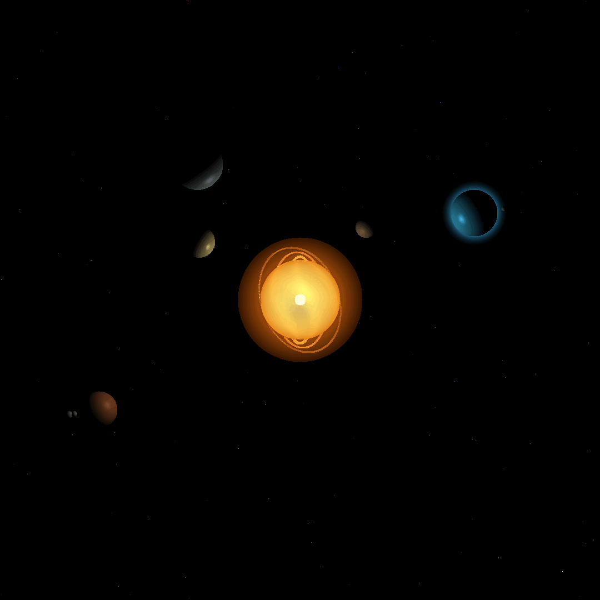
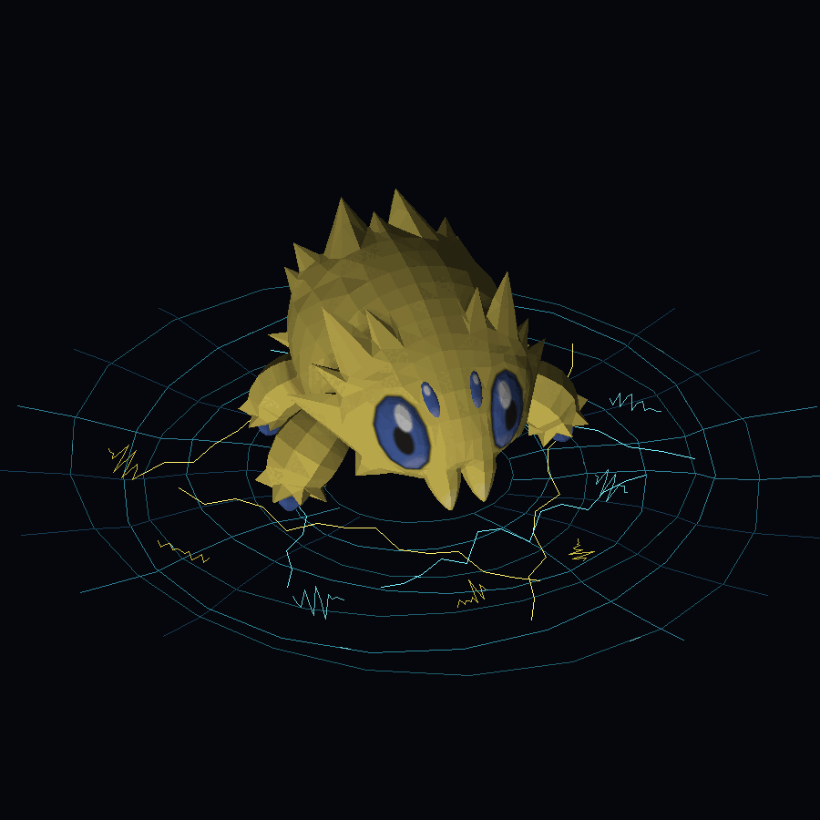
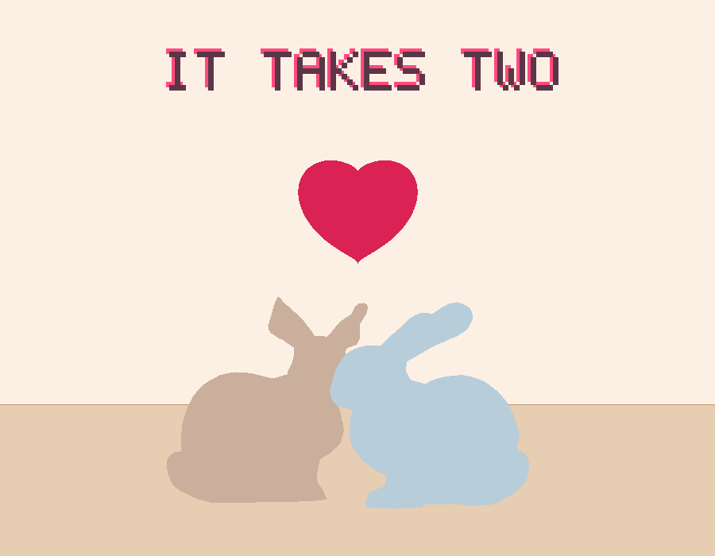
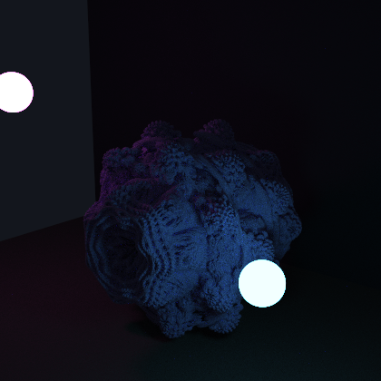

# Gartus

`gartus` is a Rust graphics library for experimenting with the full stack of
small-renderer building blocks: pixels, colors, matrices, mesh generation,
camera projection, rasterization, procedural textures, animation, MDL scripts,
and path tracing.

## Gallery

Here are a few examples of what `gartus` can do. See the `examples/` directory for more.












## Overview

The project started as a classroom-style computer graphics engine built around a
`Canvas`, transformation matrices, polygon meshes, lighting, and a Motion
Description Language. It has since grown into a reusable library with two
rendering paths:

- a fast canvas/raster path for drawing, meshes, turtle graphics, filters, and
  MDL scenes
- a physically based path-tracing path for analytic geometry, materials,
  importance sampling, volumes, SDF ray marching, and renderer-neutral scene data

## What the Library Provides

### Math and Geometry

The `gmath` module contains the shared math layer used by both renderers:

- `Point`, `Vector`, and `Ray`
- matrices, transformation stacks, and quaternions
- edge and polygon matrices
- analytic sphere, moving sphere, quad, and triangle geometry
- camera bases and camera poses
- Perlin noise, procedural helpers, and deterministic sample RNGs
- directional sampling utilities and PDFs

Mesh helpers live close to the math layer. `PolygonMatrix` can build common
triangle meshes such as boxes, prisms, crystals, spheres, tori, and height
maps, then send those meshes through either the raster pipeline or the ray
pipeline.

### Canvas Raster Graphics

The raster side is centered on `Canvas`.

It supports direct image work, line and polygon drawing, z-buffered filled
triangles, color interpolation, Phong-style lighting, textured rasterization,
filters, bitmap output, and simple 3D projection through `Camera3D`.

```rust
use gartus::prelude::*;

let mut mesh = PolygonMatrix::new();
mesh.add_centered_box(Point::new(0.0, 0.0, 0.0), 2.0, 2.0, 2.0);

let mut scene = SurfaceScene::new();
scene.add_mesh(
    mesh,
    SurfaceMaterial::new(
        LinearRgb::new(0.08, 0.06, 0.04),
        LinearRgb::new(0.85, 0.55, 0.30),
        LinearRgb::new(0.5, 0.45, 0.38),
        32.0,
    ),
);

let camera = Camera3D::new(500, 500)
    .with_look_at(Point::new(3.0, 2.0, 5.0), Point::new(0.0, 0.0, 0.0));

let image = scene.rasterize(&camera);
```

### Renderer-Neutral Scene Data

`SurfaceScene`, `SurfaceMesh`, `SurfaceMaterial`, and the shared texture types
are designed to sit above any one renderer. The same scene data can be rasterized
with `SurfaceScene::rasterize` or path traced with
`PathTracer::render_scene`.

This is the preferred layer for ordinary mesh/material content. For one-off
path-traced previews, use the convenience renderer:

```rust
use gartus::prelude::*;

let surface_scene = SurfaceScene::new();
let camera = RayCamera::new(400, 1.0);
let image = PathTracer::new(camera).render_scene(&surface_scene);
```

For animation, camera iteration, or sample-count iteration, compile once and
render the compiled scene repeatedly so the primitive table and BVH are reused:

```rust
use gartus::prelude::*;

let surface_scene = SurfaceScene::new();
let ray_scene = surface_scene.to_ray_scene();

let preview = PathTracer::new(RayCamera::new(400, 1.0)).render(&ray_scene);
let final_image = PathTracer::new(
    RayCamera::new(800, 1.0).with_stratified_grid_width(16),
)
.render(&ray_scene);
```

Use lower-level ray-tracing types directly when you need ray-specific behavior
such as glass, metal, emissive geometry, participating media, SDFs, or custom
hittables.

### Path Tracing

The `graphics::raytracing` module provides a compact path tracer inspired by the
*Ray Tracing* book series, with additional library-oriented APIs.

Core pieces include:

- `RayCamera` for path-tracing camera setup
- `PathTracer` for rendering worlds and shared surface scenes
- `Hittable`, `HittableList`, `HittableLayers`, and `RayScene`
- analytic `Sphere`, `MovingSphere`, `Quad`, triangle meshes, boxes, transforms,
  and matrix instances
- `Lambertian`, `GgxMicrofacet`, `Metal`, `Dielectric`, `DiffuseLight`,
  `Isotropic`, and `HenyeyGreenstein` materials
- checker, image, solid, noise, turbulence, and marble textures
- BVH acceleration for built-in geometry and arbitrary bounded hittables
- explicit light sampling with `SamplingTargetList` and
  `WeightedSamplingTargetList`
- configurable `SamplingStrategy` policies for material/light PDF continuation
- forced next-event light-connection helpers with
  `PathTracer::render_with_light_connections` and
  `RayCamera::render_world_with_light_connections`
- constant, gradient, function, trait-backed, and environment-map backgrounds
- lat-long environment light importance sampling with `EnvironmentLight`
- feature-gated sampled-wavelength spectral rendering with polarized `SpectralImage` output by default
- linear HDR render buffers with `HdrImage`, renderer-level tone mapping, and `.pfm`/`.hdr` output
- imported diffuse, specular, and normal-map hints for ray-traced triangle meshes
- denoising-friendly float beauty, albedo, and normal AOVs with
  `PathTracer::render_denoising_aovs`
- stratified sampling, adaptive sampling, defocus blur, motion blur, and
  configurable recursion depth
- tiled parallel rendering, progressive tile callbacks, and BVH traversal stats

The `raytracing_ggx_microfacet` example renders a GGX/Trowbridge-Reitz
roughness sweep:

```text
cargo run --example raytracing_ggx_microfacet
```

For mesh-heavy renderer-neutral scenes, call `SurfaceScene::to_ray_scene()` once
and render the compiled `RayScene` repeatedly. `PathTracer::render_scene` is
intentionally ergonomic, but it recompiles this scene every call. For built-in
ray geometry, build a `RayScene` directly so its compact primitive/material
tables and cached BVH are reused. For book-style scenes or custom hittables, use
`HittableList`.

```rust
use gartus::prelude::*;

let camera = RayCamera::new(400, 1.0)
    .with_stratified_grid_width(16)
    .with_max_depth(12)
    .with_background(LinearColor::new(0.02, 0.03, 0.05))
    .with_look_at(Point::new(3.0, 2.0, 4.0), Point::new(0.0, 0.0, 0.0));

let mut world = HittableList::new();
world.add(Sphere::with_material(
    Point::new(0.0, 0.0, 0.0),
    1.0,
    Lambertian::new(LinearColor::new(0.7, 0.4, 0.9)),
));

let image = PathTracer::new(camera).render(&world);
```

`RenderOptions::tile_size` controls tile scheduling. `PathTracer::render_progressive`
and `RayCamera::render_world_tiled_progressive` call back with a
`ProgressiveRenderUpdate` after each tile is copied, so applications can save or
display partial images. `RayScene::bvh_traversal_stats_for_rays`,
`BvhNode::bvh_traversal_stats_for_rays`, and
`TriangleMesh::bvh_traversal_stats_for_rays` expose accelerator counters for
profiling traversal quality.

The optional `spectral` feature enables sampled-wavelength rendering. It adds
`MeasuredSpectrum`, `Spectrum`, `SampledWavelength`, `SpectralImage`,
`SpectralTransportMode`, `StokesVector`, `MuellerMatrix`, and `PolarizationFrame` helpers plus
`PathTracer::render_spectral_image` /
`RayCamera::render_world_spectral_image` entrypoints. The spectral image stores
linear floating-point output before display encoding; `render_spectral` remains
as a convenience wrapper that converts that output to a display `Canvas`.
Spectral renders use Stokes/Mueller transport by default and fill
`SpectralImage::polarization` with visible-band averaged Stokes samples; call
`RayCamera::with_unpolarized_spectral_transport` for scalar spectral transport.
The ordinary `render` / `render_world` entrypoints stay RGB-compatible unless a
camera is configured with `RayCamera::with_spectral_render_transport`, which
routes those Canvas/HDR helpers through the sampled-wavelength path.
Use `MeasuredSpectrum` for measured reflectance, emission, dielectric eta, and
conductor eta/k data loaded from CSV/SPD samples. `Spectrum::Rgb` remains the
compatibility fallback for RGB materials and textures, but measured spectra are
preferred when real spectral data is available.

### Volumes

`gartus` supports both constant and non-uniform participating media.

- `ConstantMedium` handles book-style constant-density fog and smoke.
- `DensityField` and `NonUniformMedium` support spatially varying fog, dust,
  clouds, nebulae, and animated density fields.
- `FnDensityField` makes small procedural fields easy to write inline.
- `ProceduralDensityField` provides smoke, mist, plasma, nebula, and underwater
  density presets with seed, scale, speed, and majorant controls.
- `DomainWarpedDensityField` and `CurlNoiseField` add curl-noise coordinate
  warping for swirling smoke and current-like motion.
- `GridDensityField` stores baked or imported voxel densities in compact `f32`
  grids with nearest or trilinear interpolation, raw save/load helpers, and a
  metadata-backed grid format for dims, bounds, interpolation, and frame index.
- `ParticleSplatField` turns particles into accelerated density splats for
  blobs, spray, foam, and particle smoke.
- `StableFluidGrid2` simulates 2D smoke density with emitter, wind, buoyancy,
  impulse, vorticity, and obstacle helpers, then exports thick 3D density grids
  with depth falloff for volume rendering.
- `MacFluidGrid2` and `MacFluidGrid3` provide staggered-grid smoke solvers with
  face velocities, SDF obstacles, CFL stepping, pressure projection diagnostics,
  and density/temperature/fuel exports.
  `MacFluidGrid3` also has a single-phase liquid path with a liquid level set,
  `MacCellFlags::LIQUID` active cells, free-surface pressure projection, velocity
  extrapolation into nearby air, CFL substepping, and explicit viscosity
  damping. The default smoke path still treats every non-solid cell as gas;
  multiphase liquid/gas coupling with density-ratio interface jumps is future
  work.
- `MarchingCubes` extracts triangle surfaces from density grids, and
  `LiquidSurface` bakes particle splats into a liquid-like triangle mesh.

Non-uniform media use Woodcock/delta tracking against the field's maximum
density, so empty or low-density regions do not need to be explicitly meshed.

```rust
use gartus::prelude::*;

let dust = FnDensityField::new(0.05, |p: Point, time| {
    let wave = 0.5 + 0.5 * (p.x() * 2.0 + p.z() * 0.7 + time).sin();
    0.05 * wave
});

let medium = NonUniformMedium::new(
    Sphere::new(Point::new(0.0, 1.0, 0.0), 3.0),
    dust,
    LinearColor::new(0.8, 0.65, 0.45),
);

let smoke = ProceduralDensityField::smoke()
    .with_seed(42)
    .with_scale(1.8)
    .with_speed(0.6)
    .with_max_density(0.35);

let smoke_medium = NonUniformMedium::new(
    Sphere::new(Point::new(0.0, 1.0, 0.0), 3.0),
    smoke,
    LinearColor::new(0.8, 0.85, 0.9),
);

let curl_smoke = ProceduralDensityField::smoke()
    .with_seed(10)
    .with_max_density(0.4)
    .domain_warped()
    .with_warp_seed(99)
    .with_warp_strength(0.8)
    .with_warp_scale(1.4)
    .with_warp_speed(0.5);

let baked = GridDensityField::from_density_field(
    GridBounds::new(Point::new(-2.0, -2.0, -2.0), Point::new(2.0, 2.0, 2.0)),
    [64, 64, 64],
    &curl_smoke,
    0.5,
)
.with_interpolation(GridInterpolation::Trilinear);

let particles = vec![
    FluidParticle::new(Point::new(0.0, 1.0, 0.0), 0.25, 0.9),
    FluidParticle::new(Point::new(0.2, 1.1, 0.1), 0.20, 0.7),
];

let splats = ParticleSplatField::new(particles.clone())
    .with_kernel(SplatKernel::Poly6)
    .with_max_density(2.0);

let mut sim = StableFluidGrid2::new([128, 128])
    .with_dt(1.0 / 60.0)
    .with_diffusion(0.0001)
    .with_viscosity(0.00001);

for _ in 0..60 {
    sim.apply_emitter(
        StableFluidEmitter::new([64.0, 32.0], 8.0)
            .with_density(10.0)
            .with_velocity([0.0, 20.0]),
    );
    sim.apply_buoyancy(0.25);
    sim.apply_vorticity_confinement(2.0);
    sim.step();
}

let simulated_smoke = sim.to_density_volume(
    GridBounds::new(Point::new(-2.0, 0.0, -2.0), Point::new(2.0, 0.5, 2.0)),
    24,
    0.75,
);

let surface = MarchingCubes::new()
    .with_iso_value(0.5)
    .extract(&baked);

let liquid = LiquidSurface::from_particles(particles)
    .with_resolution([64, 64, 64])
    .with_iso_value(0.35)
    .build_triangle_mesh();
```

The stable-fluid examples are:

```text
cargo run --example stable_fluid_2d
cargo run --example raytracing_stable_fluid_smoke
cargo run --example simulated_smoke_volume
cargo run --example marching_cubes_sphere
cargo run --example liquid_blob_surface
```

`simulated_smoke_volume` caches metadata-backed `GridDensityField` frames under
`final/raytracing/cache/stable_fluid/` before rendering one through
`NonUniformMedium`. The solver benchmark is dependency-free and can be run with:

```text
cargo bench --bench stable_fluid
```

### Signed Distance Fields

The SDF API lets applications bring their own ray-marched geometry without
adding every fractal or implicit surface to the library.

- implement `DistanceField`
- provide world-space bounds
- wrap the field with `SdfObject`
- use any existing ray-tracing material

The example `raytracing_mandelbulb.rs` keeps its Mandelbulb estimator local to
the example and uses the library only for the generic SDF machinery.

```rust
use gartus::prelude::*;

let field = FnDistanceField::new(
    Bounds3::new((-1.0, -1.0, -1.0), (1.0, 1.0, 1.0)),
    |p: Point| (p - Point::new(0.0, 0.0, 0.0)).length() - 1.0,
);

let object = SdfObject::new(
    field,
    Lambertian::new(LinearColor::new(0.4, 0.7, 1.0)),
);
```

### Animation

`FrameRecorder` and `AnimationRenderOptions` provide frame recording and GIF
encoding. With the `rayon` feature enabled, `FrameRecorder::render_gif_auto`
uses the parallel renderer; without it, the same call falls back to sequential
rendering.

Animation options support unique frame directories, preview output, GIF delay,
and progress reporting.

```rust
use gartus::prelude::*;

let options = AnimationRenderOptions::new(
    "anim",
    "frame-",
    24,
    "final/demo.gif",
)
.preview(12, "final/demo.png")
.show_progress(true);

FrameRecorder::render_gif_auto(options, |_frame| {
    let canvas = Canvas::new(320, 240, Rgb::BLACK);
    Ok(canvas)
})
.expect("render gif");
```

### MDL Scripts

The `mdl` module contains the Motion Description Language front end and runtime.
MDL scripts can build transformation stacks, meshes, animations, materials,
camera state, lights, and output commands.

The MDL runtime can rasterize accumulated polygon scenes, and scripts can select
the ray-tracing backend with:

```text
shading raytrace
```

The legacy two-line parser remains available behind the `old_parser` feature,
but new script work should use `mdl`.

## Examples

Examples are intentionally broad because the library covers several rendering
styles.

Raster and mesh examples:

- `advanced_shapes`
- `gallery_3d`
- `mesh_teapot`
- `mesh_joltik`
- `mesh_kirby_lighting`
- `terrain`
- `transformation_matrices`
- `cosmic_loom`
- `quantum_portal`
- `celestial_dragon`

Path-tracing examples:

- `raytracing_weekend`
- `next_weekend`
- `life`
- `raytracing_fireflies`
- `raytracing_kaleidoscope`
- `raytracing_prism_rain`
- `raytracing_mandelbulb`

Turtle and script-oriented examples:

- `frac_tree`
- `maze`
- `student_mdl`
- `walle_mdl`
- `curve_cathedral`

Most examples write output into `final/` or `final/raytracing/`.

## Running

Use the normal dev profile for quick checks:

```bash
cargo check
cargo run --example gallery_3d
```

Use the render profile for full path-traced images:

```bash
cargo run --profile render --example life
cargo run --profile render --example raytracing_mandelbulb
cargo bench --bench render_performance
```

For path-tracing iteration, lower image width, depth, and samples first:

```rust
const IMAGE_WIDTH: u32 = 300;
const MAX_DEPTH: u32 = 8;
```

For final stills, prefer stratified grids:

```rust
RayCamera::new(600, 1.0)
    .with_stratified_grid_width(32)
    .with_max_depth(20);
```

For previews, adaptive sampling can stop pixels that have already converged:

```rust
RayCamera::new(400, 1.0)
    .with_adaptive_sampling(16, 256, 0.01)
    .with_max_depth(12);
```

Indoor path-traced scenes with small emitters usually converge faster when you
pass a dedicated `SamplingTargetList` or `WeightedSamplingTargetList` to
`PathTracer::render_with_lights`. `RayCamera::with_sampling_strategy` controls
whether continuation rays use material-only sampling, next-event estimation, or
a weighted material/light-target mixture; `SamplingStrategy::with_light_pdf_weight`
selects current-path continuation because the weight only applies to that mode.
`RayCamera::with_background_source`, `RayCamera::with_background_fn`,
`PathTracer::render_with_background`, and their spectral background variants
accept constant/gradient/function/trait-backed miss radiance; `EnvironmentLight`
also implements the background trait, while `render_with_environment` adds
luminance-weighted environment importance sampling.

For path-space work, BDPT and MLT are still future work. The current
`PathTracer::render_with_light_connections` helper is ordinary next-event
estimation over camera subpaths; true BDPT still needs light subpaths,
path-space MIS, emitter-surface sampling, and reusable path state.

For production-style lighting and post work, use `EnvironmentLight::from_file`
or `EnvironmentLight::from_canvas` with `PathTracer::render_with_environment`
for luminance-weighted lat-long environment sampling. Use
`TriangleMesh::from_material_mesh_imported_materials` to resolve imported
`map_Kd`, layered GGX `Ks`/`Ns` hints, and common normal-map MTL keys
(`map_Bump`, `bump`, `norm`). Use
`PathTracer::render_denoising_aovs` when an external denoiser needs matching
linear-float beauty, albedo, and shading-normal buffers plus preview canvases.

## Feature Flags

Default features:

- `external`: external image/mesh loading helpers
- `filters`: canvas filters
- `turtle`: turtle graphics
- `rayon`: parallel animation rendering

Optional compatibility feature:

- `old_parser`: legacy parser API

Optional renderer prototype feature:

- `spectral`: measured spectra, sampled-wavelength path tracing, `SpectralImage`, and Stokes/Mueller helpers

## Project Layout

```text
src/gmath/                 math, geometry, rays, sampling, noise
src/graphics/              canvas, cameras, colors, scenes, animation
src/graphics/raytracing/   path tracer, materials, BVH, volumes, SDFs
src/mdl/                   MDL lexer/parser/semantic/runtime pipeline
examples/                  raster, mesh, MDL, animation, and ray examples
```
